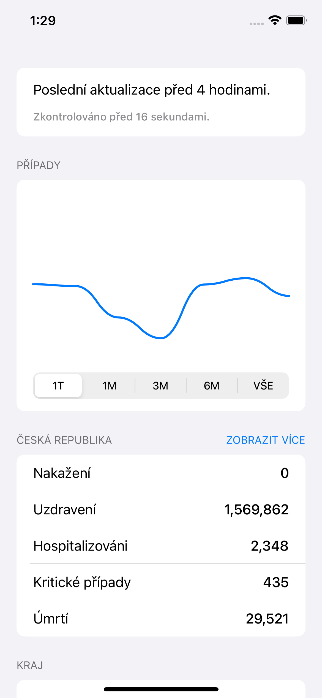
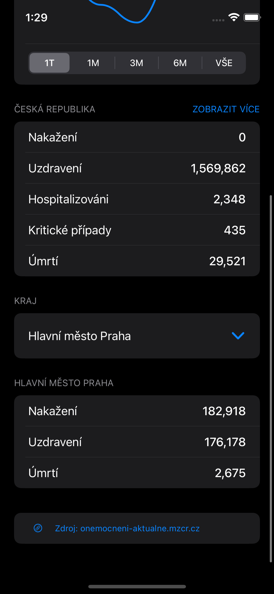

    
    
    

# 🇨🇿 COVID-19 Statistics

### Screenshots
  

### Features
- Change chart timeline (1 week, 1 month, ...)
- Change data for each region in the Czech Republic (Hlavní město Praha, Středočeský kraj, ...)
- 🇬🇧 English & 🇨🇿 Czech localization

### API
[https://apify.com/petrpatek/covid-cz](https://apify.com/petrpatek/covid-cz)

### Note
> I have build this app to be published to the App Store. (Unfortunately they have special requirements for COVID-19 related apps, that I don't meet)
